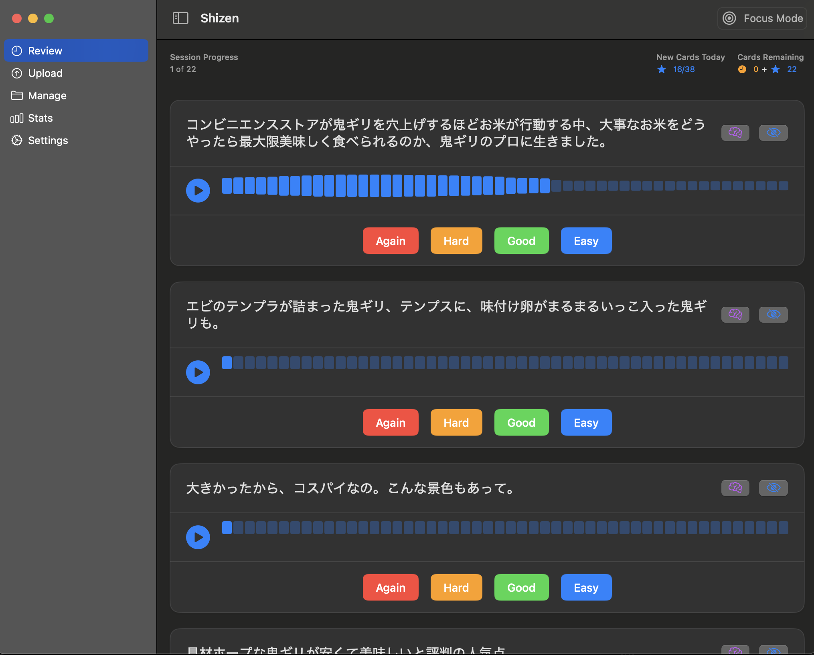

# Shizen - Japanese Language Learning Assistant



A macOS app for immersive Japanese learning through audio content, powered by AI analysis and spaced repetition.

## Features

- **Multi-source Audio Import**
  - Record directly in-app
  - Upload local files (MP3/WAV/M4A/AAC)
  - Download podcast episodes
  - Extract audio from YouTube videos

- **Smart Learning System**
  - Automatic Whisper transcription
  - AI-powered text analysis (Ollama integration)
  - Customizable Spaced Repetition (SRS)
  - Focus Mode for intensive practice

- **Content Management**
  - Bulk segment operations
  - Duplicate detection
  - Playback speed control (0.75x-2x)
  - Detailed progress statistics

## Requirements

- **System**
  - macOS 12 Monterey or newer
  - 8GB RAM minimum (16GB recommended for AI features)

- **Dependencies**
  - [Python 3.9+](https://www.python.org/)
  - [FFmpeg](https://ffmpeg.org/)
  - [Ollama](https://ollama.ai/) (running locally)
  - [yt-dlp](https://github.com/yt-dlp/yt-dlp)

## Installation

### Swift Package Manager

```bash
# Clone repository
git clone https://github.com/jimjatt1999/ShizenNative.git
cd shizen

# Install dependencies
brew install python ffmpeg
pip install yt-dlp

# Build and run
swift build
swift run

